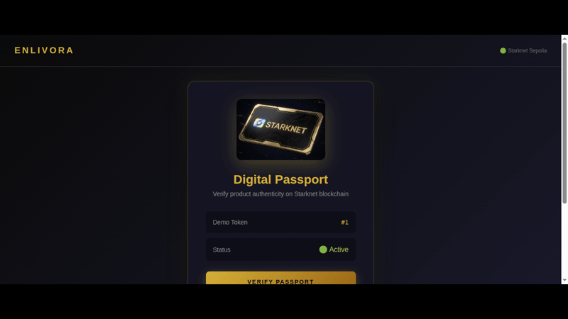
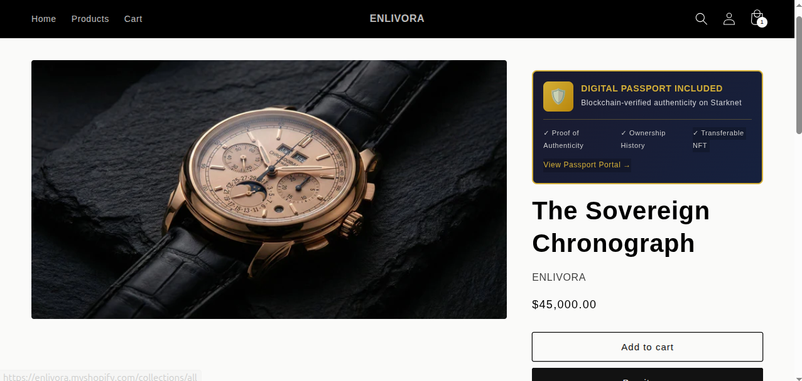
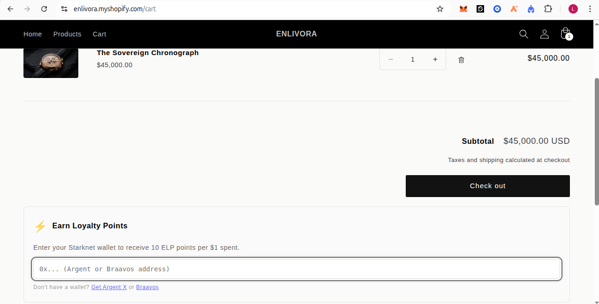
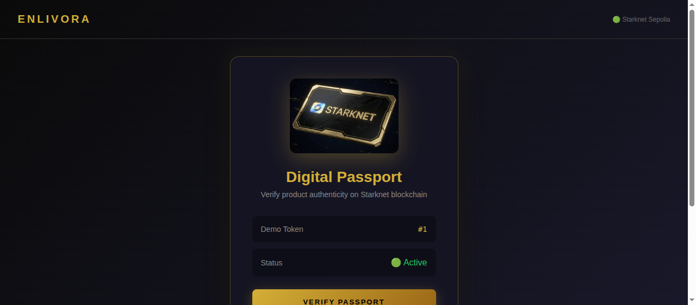
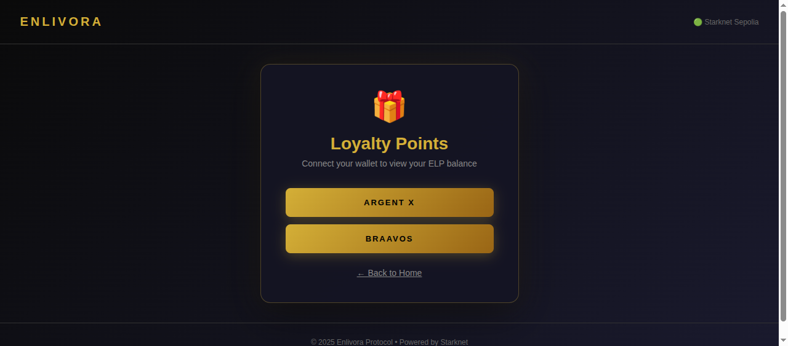
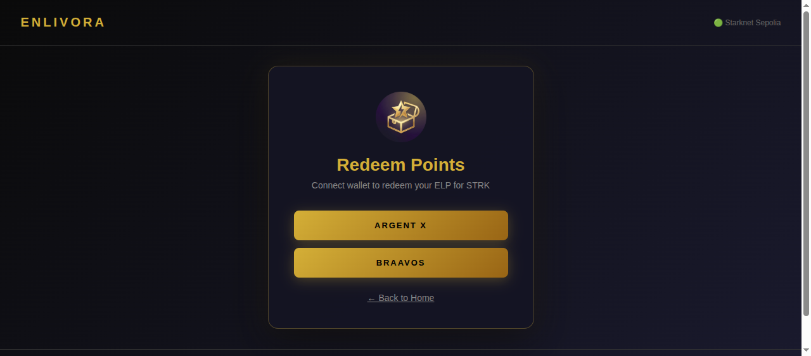
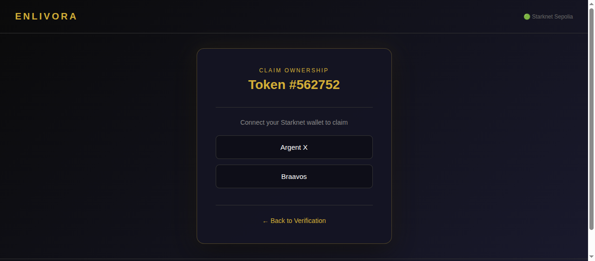

# Enlivora Commerce Pass


Enlivora Commerce Pass is a Starknet-native infrastructure designed to bridge traditional e-commerce with blockchain transparency. It enables Shopify and WooCommerce merchants to issue digital product passports (NFTs) and onchain loyalty points without disrupting the existing user checkout experience.

## Live Demo

| | Link |
|---|---|
| **Passport Portal** | [pass.enlivora.com](https://pass.enlivora.com) |
| **Backend API** | [api.enlivora.com](https://api.enlivora.com) |
| **Shopify Demo Store** | [enlivora.myshopify.com](https://enlivora.myshopify.com) *(password protected)* |

### Demo Video
[](https://youtu.be/wiz-aDqC17w)

## Screenshots



| Product | Cart | Home | Loyalty | Redeem | Claim |
|:---:|:---:|:---:|:---:|:---:|:---:|
|  |  |  |  |  |  |

## Problem & Solution

Premium boutiques and Direct-to-Consumer (DTC) brands face significant challenges in scaling due to lack of trust in resale markets and fragmented loyalty systems.

*   **Problem:** Buyers hesitate to purchase premium items due to authenticity concerns ("Is this real?"). Brands lose visibility and control once a product enters the secondary market.
*   **Solution:** Enlivora creates an onchain "Digital Twin" for each physical product. This passport proves authenticity and ownership history. Additionally, an onchain loyalty system rewards customers with non-transferable points that can be redeemed for STRK, creating a verifiable and portable rewards ecosystem.

## Key Features

*   **Product Passport (ERC-721):** A mintable digital asset linked to physical inventory. Supports ownership transfer and revocation by the issuer.
*   **Loyalty Ledger (Non-transferable Token):** An onchain points system where merchants can credit points based on fiat purchases (e.g., 10 points per $1).
*   **Shopify Integration:** A native Shopify App that listens to `orders/paid` webhooks to automate minting and point crediting.
*   **Multi-Token Rewards:** A flexible vault system allowing customers to redeem points for network tokens (STRK).
*   **Gasless Experience:** Designed with Account Abstraction in mind to minimize Web3 friction for end-users.

## Account Abstraction (AA)

Enlivora leverages Starknet's native Account Abstraction to provide a seamless, gasless experience for end-users:

### Current Implementation
- **Backend-Sponsored Transactions:** All passport claims and loyalty point operations are signed and paid by the merchant's backend wallet. Customers never pay gas fees.
- **Native AA Wallets:** Full support for Argent X and Braavos, which are native AA wallets on Starknet.
- **Meta-Transactions:** The backend acts as a relayer, executing transactions on behalf of users.

### How It Works
```text
Customer Action          Backend (Relayer)           Starknet
      │                        │                        │
      │  "Claim Passport"      │                        │
      ├───────────────────────>│                        │
      │                        │  Sign & Submit Tx      │
      │                        │  (Pays Gas)            │
      │                        ├───────────────────────>│
      │                        │                        │  Execute
      │                        │      Tx Confirmed      │
      │      Success!          │<───────────────────────┤
      │<───────────────────────┤                        │
```

### Benefits
- **Zero Gas for Users:** Customers interact with blockchain without holding ETH/STRK
- **Familiar UX:** Web2-like experience with Web3 security
- **Merchant Control:** Businesses sponsor transactions as a customer acquisition cost

## System Architecture

The system operates as a middleware between the Web2 e-commerce platform and the Starknet Layer 2 validity rollup.

```text
+----------------+       +--------------------+       +-------------------------+
|  E-Commerce    |       |   Enlivora Cloud   |       |    Starknet (L2)        |
| (Shopify/Woo)  |       |   (Node.js API)    |       |                         |
+----------------+       +--------------------+       +-------------------------+
|                |       |                    |       |                         |
|  Order Paid    | ----> |  Webhook Handler   | ----> |  LoyaltyPoints.cairo    |
|   (Webhook)    |       |   (Calculate Pts)  |       |    (Credit Points)      |
|                |       |                    |       |                         |
|  "Enable Pass" | ----> |  Mint Service      | ----> |  Passport721.cairo      |
|   (Admin UI)   |       |   (Sign Tx)        |       |    (Mint Token)         |
|                |       |                    |       |                         |
+----------------+       +--------------------+       +-------------------------+
                                   |
                                   v
                         +--------------------+
                         |  Customer Frontend |
                         | (Next.js / Wallet) |
                         +--------------------+
```

## Project Structure

This repository follows a monorepo structure:

*   `contracts/`: Starknet smart contracts written in Cairo (managed with Scarb).
*   `backend/`: Node.js/Express service for off-chain logic and transaction signing.
*   `shopify-app/`: Remix-based embedded application for the merchant admin panel.
*   `frontend-passport/`: Next.js application for customers to verify and claim their digital assets.
*   `docs/`: Detailed specifications and grant proposals.

## Deployed Contracts (Sepolia Testnet)

| Contract | Address | Explorer Link |
| :--- | :--- | :--- |
| **LoyaltyPoints (ELP)** | `0x0733ceef104572b040eef659f697a2d4931c13ac1446b103f0e0a9c4b7613841` | [StarkScan](https://sepolia.starkscan.co/contract/0x0733ceef104572b040eef659f697a2d4931c13ac1446b103f0e0a9c4b7613841) |
| **Passport721 (ENL)** | `0x060691688c40f8b98fd8d23e9a2c9864ddece643cf195a095e8b9d6d54210839` | [StarkScan](https://sepolia.starkscan.co/contract/0x060691688c40f8b98fd8d23e9a2c9864ddece643cf195a095e8b9d6d54210839) |
| **RewardsVault** | `0x02d647fa20fbe4cd177364953bf1b7057135f5712380c1477fb4328f1c67fc96` | [StarkScan](https://sepolia.starkscan.co/contract/0x02d647fa20fbe4cd177364953bf1b7057135f5712380c1477fb4328f1c67fc96) |

## Prerequisites

*   **Node.js**: v18.0.0 or higher
*   **Scarb**: Cairo package manager (v2.4+)
*   **Starkli**: Starknet CLI tool
*   **Starknet Wallet**: Argent X or Braavos

## Installation & Development

### 1. Smart Contracts

Navigate to the contracts directory to build and test the Cairo contracts.

```bash
cd contracts
scarb build
scarb test
```

To deploy to the Sepolia testnet, ensure you have a funded Starknet account and configure the deployment scripts in `backend/scripts/`.

### 2. Backend Service

The backend acts as the bridge. It requires configuration for both the blockchain provider and the e-commerce platform.

```bash
cd backend
cp .env.example .env
# Edit .env with your Starknet Private Key and RPC URL
npm install
npm run dev
```

### 3. Frontend Applications

Install dependencies for the customer-facing interface and the merchant dashboard.

```bash
# Passport Interface
cd frontend-passport
npm install
npm run dev

# Shopify Admin App
cd ../shopify-app
npm install
npm run dev
```

## Documentation

For a deeper dive into the technical implementation and roadmap, please refer to the `docs/` directory:
*   [Implementation Spec (MVP)](docs/SPEC.md)
*   [Grant Proposal One-Pager](docs/Grant_One-Pager.md)

### Developer Background

| Project | Achievement | Link |
|---------|-------------|------|
| **FashionSwap** | 🥈 2nd Place - Starknet Re{Solve} Hackathon | [GitHub](https://github.com/LevCey/FashionSwap) • [Devpost](https://devpost.com/software/fashionswap) |

Proven track record in Starknet ecosystem with Cairo smart contract development and dApp delivery.


## License

MIT
